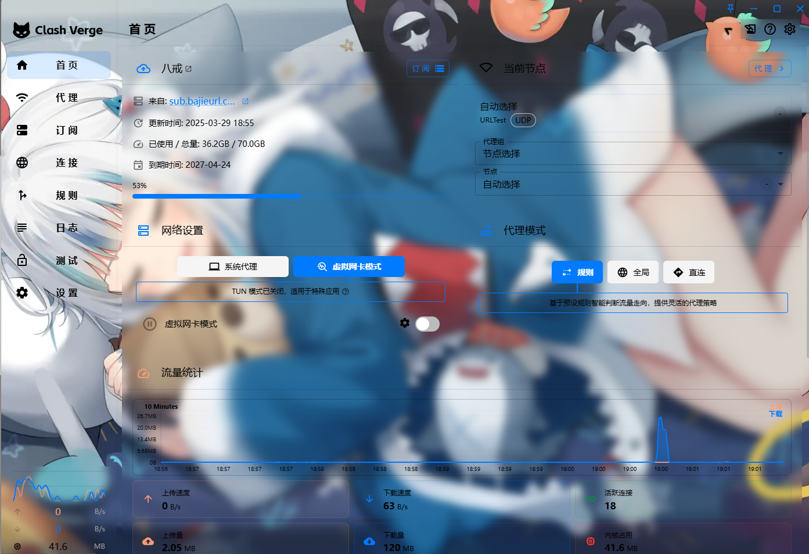
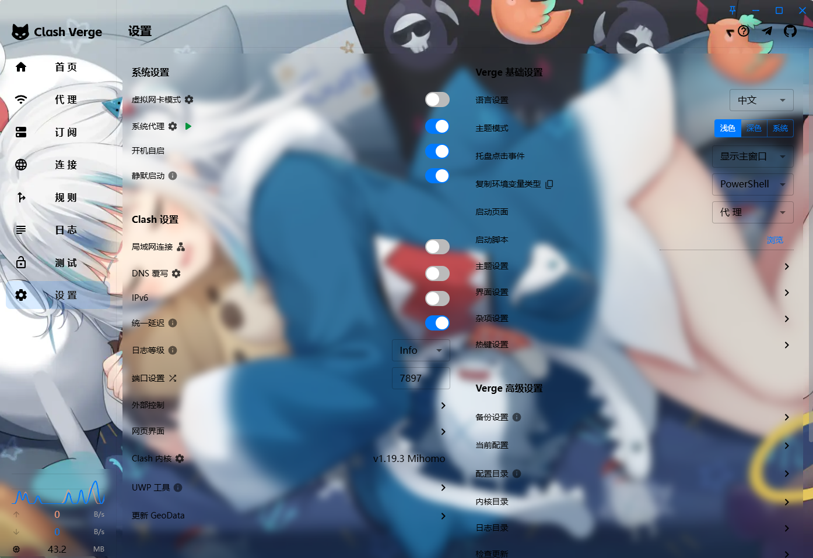

# 适用于 clash-verge-rev 的 Gura 主题皮肤

## 示例界面
  

## 使用步骤

1. 打开 clash-verge 设置界面
2. 点击主题设置
3. 编辑 CSS
4. 将此仓库中的 CSS 文件内容粘贴进去
5. 保存  
## Thanks
* [Miku-Skin-ClashVerge](https://github.com/Duke486/Miku-Skin-ClashVerge)
* [clash-verge-rev](https://github.com/clash-verge-rev/clash-verge-rev)
